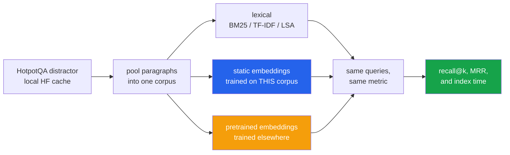

<h1 align="center">embedding-fair-comparison</h1>
<p align="center"><i>Method, or training data?</i></p>

<p align="center">
  <a href="#the-result-so-far">Results</a> &middot;
  <a href="#the-setup">Setup</a> &middot;
  <a href="#what-is-held-constant">What is held constant</a> &middot;
  <a href="#status--3-of-7-methods-still-pending">Status</a> &middot;
  <a href="#limitations">Limitations</a> &middot;
  <a href="#run-it">Run it</a>
</p>

<p align="center">
  
  
  
  
  
  <a href="LICENSE"></a>
</p>

---

> ### Most embedding comparisons are training-data comparisons wearing a method comparison's clothes.

The standard tutorial puts **TF-IDF fitted on your corpus** next to **pretrained word
vectors trained on 100 billion words** next to **pretrained BERT**, and concludes that the
neural method is better.

That conflates two different variables. This separates them: every method is scored on the
same corpus, the same queries and the same metric, and the ones **trained locally** are
reported separately from the ones that **arrived pretrained**.

It also includes **BM25** — the baseline almost no embedding comparison reports, and the one
that keeps turning out to be hard to beat.

---

## The result so far

HotpotQA distractor split · 2,964 documents · 300 queries · exactly 2 gold documents each ·
0 missing gold.

| Method | Trained on | r@1 | r@5 | **r@10** | r@20 | MRR | Index time |
|---|---|---:|---:|---:|---:|---:|---:|
| **BGE-small** | billions of words, elsewhere | 0.437 | 0.868 | **0.943** | 0.967 | 0.923 | 27.8 s |
| **BM25** | this corpus | 0.355 | 0.665 | **0.865** | 0.933 | 0.799 | **0.1 s** |
| TF-IDF | this corpus | 0.288 | 0.623 | 0.842 | 0.923 | 0.710 | 1.1 s |
| LSA (SVD) | this corpus | 0.173 | 0.463 | 0.735 | 0.855 | 0.513 | 3.3 s |

### What this says so far

**BM25 — zero parameters, zero training, one tenth of a second to index — lands within 8
points of a pretrained neural embedding at recall@10, and within 3.4 points at recall@20.**

The pretrained model wins, and it should: it has seen roughly a hundred thousand times more
text than this corpus contains. But the margin is far smaller than "neural replaced lexical"
implies, and it costs **270x** the indexing time.

The gap is widest at **r@1 and MRR** — where getting the single best document first matters —
and narrows as k grows. Which is the practically useful shape: if a reranker or an LLM sees
the top 20 anyway, BM25 hands it almost the same candidates.

---

## The setup

**Why HotpotQA's distractor split.** Each question ships ten paragraphs, exactly two of
which are gold. The ground truth is exact, so there are no relevance judgements to guess at.
Pooling paragraphs across many questions turns "pick 2 from 10" into "pick 2 from ~3,000",
which is a retrieval problem rather than multiple choice.

**No downloads.** The dataset is read from the local Hugging Face cache; BM25, TF-IDF and
LSA train on the corpus itself.



## What is held constant

A comparison is only about the method if nothing else moves:

| Variable | Held at |
|---|---|
| Tokenizer | one shared function, for every lexical method |
| Corpus | identical |
| Queries | identical |
| Metric | recall@1/5/10/20 and MRR |
| **Dimensionality** | **300 for every vector method** — so a win is not simply a wider vector |
| Pooling | plain mean of word vectors — what the tutorials do |

The one thing deliberately **not** held constant is training data, because that is the
variable under test. It is a column in the table, not a footnote.

---

## Status — 3 of 7 methods still pending

| Method | State |
|---|---|
| BM25, TF-IDF, LSA, BGE-small | ✅ measured |
| **word2vec (trained on this corpus)** | 🔴 blocked — `gensim` still downloading |
| **fastText (trained on this corpus)** | 🔴 blocked — same |
| **nomic-embed (pretrained)** | 🟡 running — embedding 2,964 documents via ollama |

**The two blocked ones are the point of the repository.** word2vec and fastText trained on
*this* 893k-token corpus, against BGE trained on billions, is the comparison that separates
method from training data. Until they land, the table above is a lexical-vs-pretrained
result, not the full experiment.

Nothing is estimated in the meantime. The code path exists and is tested; the rows will
appear when the library does.

---

## Limitations

- **One corpus, one domain.** HotpotQA paragraphs are Wikipedia prose. Nothing here says
  how these methods compare on code, legal text or transcripts.
- **300 queries in the results above**, not the full split. Enough to separate the methods,
  not enough for tight confidence intervals — and no intervals are reported.
- **Mean pooling is crude.** Better pooling would lift the static embeddings. That is
  deliberate: the question is what the *method* buys at the level everyone actually uses it.
- **Retrieval only.** A cross-encoder reranker on top would change every number here, and
  is not part of this comparison.
- **BGE gets its query prefix**, as its authors intend. That is a small advantage the
  lexical methods have no equivalent of.

## Run it

```bash
python src/corpus.py 1000              # build and inspect the benchmark
python src/evaluate.py 300             # score every available method
python src/evaluate.py 300 BM25,TfIdf  # or just some
streamlit run ui/app.py                # dashboard
pytest -q                              # 19 tests, no dataset, no network
```

## Tests

19 tests on a hand-built five-document corpus — no dataset, no network. They check the
metrics, the shared tokenizer, and BM25's actual properties: that term frequency
**saturates**, that length is **penalised**, and that IDF is never negative.

One of them is a regression test: `TruncatedSVD` raises rather than clamping when
`n_components` exceeds the vocabulary size, so LSA crashed on any small corpus until it was
clamped.

## Layout

```
src/corpus.py       build the benchmark from the cached HotpotQA distractor split
src/retrievers.py   seven methods, including BM25 implemented rather than imported
src/evaluate.py     score them all, write results/scores.json
ui/app.py           Streamlit dashboard
tests/              19 tests, no dataset needed
```

## Stack

`Python 3.11+` · `scikit-learn` · `sentence-transformers` · `gensim` · `Ollama` ·
`NumPy` · `pandas` · `Streamlit` · `Altair` · `pytest`

## Keywords

word embeddings · word2vec · GloVe · fastText · BM25 · TF-IDF · LSA · LSI · SVD ·
sentence embeddings · BGE · nomic-embed · retrieval · information retrieval · recall@k ·
MRR · HotpotQA · lexical vs dense retrieval · sparse retrieval · NLP · fair comparison ·
ablation · training data vs method · reproducible evaluation

## Licence

MIT — see [LICENSE](LICENSE).
