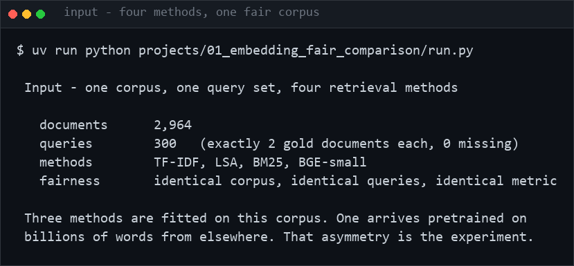
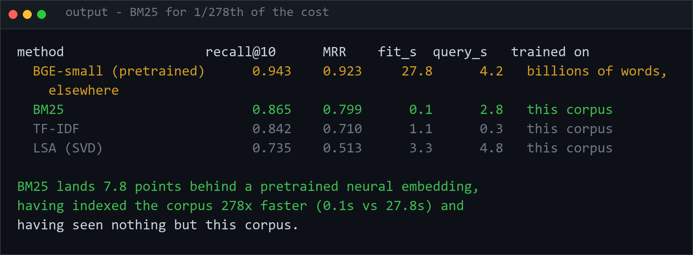

<h1 align="center">nlp-lab</h1>
<p align="center"><i>Classic NLP techniques, measured against each other on the same corpus</i></p>

<p align="center">
  <a href="#the-projects">The projects</a> &middot;
  <a href="#the-through-line">The through-line</a> &middot;
  <a href="#running-a-project">Running a project</a> &middot;
  <a href="#stack">Stack</a>
</p>

<p align="center">
  <a href="https://github.com/hammas159/nlp-lab/actions/workflows/ci.yml"></a>
  
  
  
  <a href="LICENSE"></a>
</p>

---

Classic NLP, done as **comparisons rather than tutorials**. Each project takes a family of
techniques, runs them over the same corpus with everything held constant that can be, and
reports what actually separates them.

The rule throughout: **if two methods differ in more than one way, the comparison is not
about the method.**

---

## The through-line

Most technique comparisons in NLP are not comparisons at all. The usual shape is:

| What is compared | What is actually different |
|---|---|
| TF-IDF *fitted on your corpus* | corpus size, vocabulary, fitting procedure |
| pretrained word2vec | **100 billion words** of training data |
| pretrained BERT | different data, different objective, different dimensionality |

Three methods, but also three training sets, three vocabularies and three vector widths.
The conclusion "the neural one is better" cannot be separated from "the neural one saw more
text".

**Every project here fixes everything except the one variable under test**, and reports the
variable it could not fix as a column rather than a footnote.

---

## The projects

| # | Project | Question | Status |
|---|---|---|---|
| **01** | [Embedding fair comparison](projects/01_embedding_fair_comparison) | Is a neural embedding's advantage the *method*, or the 100 billion words it was trained on? | ✅ complete |
| **02** | [Preprocessing ablation](projects/02_preprocessing_ablation) | Which parts of the standard NLP pipeline actually help - and do they compose? | ✅ complete |
| **03** | [The reranker ceiling](projects/03_reranker_ceiling) | Does a reranker rescue a weak first stage, or only reorder it? | ✅ complete |
| **04** | [Near-duplicate detection](projects/04_near_duplicate_detection) | How much does exact-match-on-a-normal-form miss? | ✅ complete |
| **05** | [Zipf and Heaps](projects/05_zipf_and_heaps) | Five estimators, one exponent — how far apart do they land, and is it a power law at all? | ✅ complete |
| **06** | [PPMI-SVD vs SGNS](projects/06_ppmi_svd_vs_sgns) | Is word2vec's advantage the objective, or the hyperparameters that shipped with it? | ✅ complete |
| **07** | [The SMART weighting grid](projects/07_smart_weighting_grid) | "TF-IDF" names forty-five schemes. How far apart are they? | ✅ complete |
| **08** | [gzip-kNN](projects/08_gzip_knn) | Is the compression result about compression, or about the scoring? | ✅ complete |
| **09** | [Collocations](projects/09_collocations) | Five association measures, one set of counts. Do they agree on anything? | ✅ complete |
| **10** | [Pseudo-relevance feedback](projects/10_relevance_feedback) | It improves the mean. What does it do to each query? | ✅ complete |
| **11** | [Text clustering](projects/11_text_clustering) | Does silhouette find the number of clusters the labels say is there? | ✅ complete |
| **12** | [Gazetteer NER](projects/12_gazetteer_ner) | What bounds a dictionary tagger — its coverage, or its own ambiguity? | ✅ complete |
| **13** | [Language identification](projects/13_language_id) | It is reported on documents and used on queries. What happens at query length? | ✅ complete |
| **14** | [String similarity](projects/14_string_similarity) | Seven fuzzy-matching measures. Does the ranking survive changing the noise? | ✅ complete |
| **15** | [Sentence boundaries](projects/15_sentence_boundaries) | Four splitters a methods section would describe identically. How far apart are they? | ✅ complete |
| **16** | [Stylometry](projects/16_stylometry) | Authorship attribution scores 0.965. How much of that is style, and how much is topic? | ✅ complete |
| **17** | [Classical topic models](projects/17_topic_models) | Topic models are ranked by coherence. Does coherence agree with a task? | ✅ complete |
| **18** | [Tokenisation](projects/18_tokenisation) | BPE vs WordPiece vs Unigram — how much is the algorithm worth, against the knob beside it? | ✅ complete |

### 01 · Embedding fair comparison

Seven retrievers over one corpus — BM25, TF-IDF, LSA, word2vec and fastText **trained on
this corpus**, and BGE and nomic-embed **trained on billions of words elsewhere**.

HotpotQA: 2,964 documents, **277,259 tokens**, 300 queries, exactly 2 gold each.

| Method | Trained on | r@1 | **r@10** | r@20 | MRR |
|---|---|---:|---:|---:|---:|
| BGE-small | billions of words | **0.437** | **0.943** | **0.967** | **0.923** |
| nomic-embed | billions of words | 0.432 | 0.935 | 0.965 | 0.915 |
| **BM25** | this corpus | 0.355 | 0.865 | 0.933 | 0.799 |
| TF-IDF | this corpus | 0.288 | 0.842 | 0.923 | 0.710 |
| LSA (SVD) | this corpus | 0.173 | 0.735 | 0.855 | 0.513 |
| word2vec | **this corpus** | 0.033 | **0.140** | 0.198 | 0.128 |
| fastText | **this corpus** | 0.027 | **0.135** | 0.192 | 0.117 |

Four of those rows are dense vectors compared by cosine — BGE, nomic-embed, word2vec,
fastText. They span **0.808**, and the split falls exactly along *where the vectors came
from*. The widest gap the method axis produces between two methods fitted on identical
data, BM25 against LSA, is **0.130**.

**So "embeddings beat TF-IDF" is a fact about a download, not an algorithm.** Run an
embedding method on the corpus in front of you and it loses to TF-IDF by 0.702.

The cleanest controlled comparison is the worst news for word2vec. LSA, word2vec and
fastText are all **300-dimensional, all fitted on this corpus, scored identically** — and
**a 1990s truncated SVD beats both neural objectives by about 0.6** (0.735 against 0.140
and 0.135). Not a small-corpus excuse: LSA had the same small corpus. Whatever word2vec's
advantage over LSA is, you cannot get it by running word2vec — only by downloading someone
else's.

Two more: the two pretrained models **agree to within 0.008** despite different groups,
data, architectures and widths. And **BM25, with zero parameters, beats everything trained
on this corpus**, landing 0.078 behind the best pretrained model at r@10 and 0.034 at r@20.

(r@1 is capped at 0.500 by construction — two gold documents, one slot — so BGE's 0.437 is
87% of the attainable maximum. The 300-dimension control covers only the corpus-trained
methods; BGE is 384 and nomic-embed 768, which the project README flags as a confound.)

### 02 · Preprocessing ablation

Every tutorial teaches lowercase → strip punctuation → remove stopwords → stem → drop
short tokens as one step called "preprocessing". It is several independent decisions, and
**they are not additive.**

| Variant | recall@10 | Δ | p | Verdict |
|---|---:|---:|---:|---|
| baseline (lowercase only) | 0.865 | — | — | *baseline* |
| **stopwords + stemming** | **0.888** | **+0.023** | **0.005** | ✅ **REAL** |
| + Porter stemming | 0.887 | +0.022 | 0.012 | ✅ REAL |
| + remove stopwords | 0.877 | +0.012 | 0.034 | ✅ REAL |
| **the full tutorial pipeline** | 0.875 | +0.010 | **0.360** | ❌ **within noise** |
| + drop tokens < 3 chars | 0.862 | −0.003 | 0.676 | ❌ within noise |

**Stemming works. Stopword removal works. Add a third step that does nothing on its own,
and the significant +2.3 point gain becomes indistinguishable from noise.**

The mechanism: Porter stemming *produces* short stems (`aging` → `ag`), and the length
filter then deletes exactly the tokens stemming just created. That interaction is invisible
if "preprocessing" is evaluated as one block — which is how it is almost always taught.

Significance is a **paired bootstrap over queries**, because a table of six numbers two
points apart invites a ranking that the sample size may not support. Three of six
differences here are real; the other three are reported as noise rather than ranked.

### 03 · The reranker ceiling

A cross-encoder can only **reorder** what the first stage handed it, so the first stage's
recall@50 is a hard ceiling on anything achievable at k ≤ 10.

| First stage | r@10 before | r@10 after | Ceiling (r@50) | Converted |
|---|---:|---:|---:|---:|
| **BM25** | 0.865 | **0.922** | 0.967 | 95.3% |
| TF-IDF | 0.842 | 0.918 | 0.955 | 96.1% |
| BGE-small | 0.943 | 0.942 | 0.978 | 96.3% |
| random (control) | 0.003 | 0.022 | 0.022 | 100% |

**The spread between real retrievers collapses from 0.102 to 0.023.** BGE gains nothing
(−0.001) because it was already ordering well; the cheap retrievers are the ones the
reranker rescues.

Every first stage converts **about 96% of its ceiling**, whichever one it is. So what
separates retrievers is not how well they rank, but **what they fetch at all** — the first
stage's job is recall@50, not precision@10.

The **random control** is what makes the ceiling a measurement rather than an assertion: it
converts 100% of its ceiling and still scores 0.022, because a reranker cannot retrieve a
document that was never fetched.

**This reframes project 01.** If a reranker is in the pipeline — and in any serious RAG
system it is — BM25's 8-point deficit becomes 2, for 1/270th of the indexing cost.

### 04 · Near-duplicate detection

[devign-leakage](https://github.com/hammas159/devign-leakage) found duplicates by hashing a
normalised form, and stated that functions differing by one statement would be invisible to
it. This measures how many that is.

| Method | Pairs found |
|---|---:|
| exact hash | 2 |
| structural hash | 22 |
| **MinHash + LSH, verified ≥ 0.8** | **30** |

| | Count |
|---|---:|
| Near-duplicates **hashing missed** | **26 of 30 (87%)** |
| …of those, **conflicting labels** | **16** |

**devign-leakage reported 4 conflicting pairs and called the ceiling "small". The real
count is 20 — a five-fold increase, and the earlier number was an artefact of the detection
method rather than a property of the dataset.**

MinHash and LSH are implemented rather than imported, and the estimator is **validated
against exact Jaccard**: 0.0199 MAE on similar pairs, which is what √(s(1−s)/n) predicts at
s ≈ 0.9. The MAE on *random* pairs is 0.0011 and is reported only to explain why it is
meaningless — random pairs are almost all disjoint, and MinHash returns exactly 0 for those.

### 05 · Zipf and Heaps

Five estimators of "the Zipf exponent" on one million matched tokens of English prose:

| Estimator | a |
|---|---:|
| OLS, top 1000 ranks | 0.858 |
| OLS, log-binned | 1.032 |
| split-half (Piantadosi) | 1.063 |
| OLS over all ranks | 1.271 |
| MLE (Clauset), converted | 1.418 |
| **spread** | **0.560** |

**The five numbers everyone calls the Zipf exponent span 0.56 on the same corpus** — wider
than the gap between any two registers measured here. Two of them are not even estimating the
same parameter: a rank-frequency slope and a Clauset power-law fit differ by `g = 1 + 1/a`,
so every value is converted before it is tabulated.

On synthetic text whose exponent is known, **Piantadosi's split-half correction is the most
biased of the five** (−0.35). It removes the correlated-error problem it was designed for and
introduces a larger censoring bias, because a type absent from the frequency half cannot be
ranked and the types that go missing are exactly the rarest ones.

**English word frequencies then fail Clauset's goodness-of-fit test outright** (p = 0.00,
100 synthetic refits) while C identifier frequencies pass it (p = 0.62).

For Heaps' law, the textbook relation `b = min(1, 1/a)` predicts 1.000 against a measured
0.717; simulating a corpus of the same finite size predicts 0.839. And `b` is not a constant —
it drifts from 0.784 to 0.631 within the same corpus, so **a Heaps exponent quoted without a
token count names no quantity.**

The bill: because `b < 1`, vocabulary never saturates, and **6.49% of held-out prose tokens
are of types no vocabulary built from the training half could contain at any size** — 11.19%
for C source. That plateau is a floor, not a diminishing return.

The Hurwitz zeta is implemented rather than imported, and checked against π²/6, π⁴/90 and
Apéry's constant rather than against another library.

### 06 · PPMI-SVD vs SGNS

Levy & Goldberg (2014) proved that skip-gram with negative sampling is implicitly
factorising a word-context matrix of `PMI(w,c) − log k`. So factorise it explicitly, and
transfer word2vec's hyperparameters to the counting model one at a time:

| Configuration | recall@10 | Δ |
|---|---:|---:|
| PPMI + SVD, as usually taught | 0.118 | — |
| + dynamic context window | 0.107 | −0.011 |
| + subsample frequent words | 0.193 | +0.074 |
| + context distribution smoothing | 0.194 | +0.076 |
| + shifted PMI (k = 5) | 0.311 | +0.193 |
| **+ eigenvalue weighting p = 0.5** | **0.371** | **+0.253** |
| + add context vectors (w + c) | 0.326 | −0.045 |
| **SGNS, 25 epochs** | **0.371 / 0.380** | **−0.001 / −0.009, p = 0.969 / 0.331** |

**The counting model ends up statistically indistinguishable from the neural one** — shown
across two independent runs, because gensim's four worker threads make SGNS non-reproducible
in the second decimal. Both runs put the confidence interval across zero. The textbook
version reaches roughly a third of SGNS; the same counting model with word2vec's
hyperparameters matches it, with no gradient computed anywhere.

The negative-sampling shift alone is worth +0.193 — more than every other transfer
combined, and it reads like an optimisation detail rather than a modelling choice. Two of
the seven rungs made things *worse*, and both are standard recommendations.

SGNS at 5 epochs scores 0.088 and at 25 epochs 0.371, so the comparison is run at both:
against the 5-epoch model the counting side would have "won" by 0.283, which would have
been a statement about epochs.

### 07 · The SMART weighting grid

Salton & Buckley named the TF-IDF family in 1988 with a three-letter code: five
term-frequency variants, three document-frequency variants, three normalisations. **Every
one of the forty-five is "TF-IDF".** On this lab's corpus, with the query side held fixed:

| | scheme | recall@10 |
|---|---|---:|
| best | `atc` | **0.893** |
| BM25 | — | 0.865 |
| **textbook** | **`lnc`** | **0.872** (17th of 45) |
| worst | `nnn` | 0.493 |

**Spread 0.400 — five times the 0.078 gap project 01 reports between BM25 and a pretrained
neural embedding on the same corpus.** A reported 3-point gain from replacing "TF-IDF" is
smaller than the distance between two things both called TF-IDF.

The term-frequency letter is worth three times the idf letter (spread 0.146 against 0.053),
which inverts the usual emphasis — the family is named after its smallest component.

And **query-side normalisation moves the ranking by exactly 0.000**: it scales every score
for a query by one constant, so it cannot reorder anything. The third letter of the query
code is inert for every rank-based metric, and the 45 query schemes are **15 distinct
rankings wearing 45 names**.

### 08 · gzip-kNN

`gzip` plus k-nearest-neighbours, reported to beat BERT on low-resource text
classification. The distance is real; the step that turns k neighbours into a prediction is
where the number came from. The published implementation used **k = 2** and resolved ties by
checking whether the true label was among the two.

One gzip distance matrix over 1,000 Devign functions, three ways of reading it:

| k | tie rate | `oracle_tie` (published) | `nearest_tie` | `random_tie` |
|---:|---:|---:|---:|---:|
| 1 | 0.000 | 0.574 | 0.574 | 0.574 |
| **2** | **0.454** | **0.804** | **0.574** | 0.588 |
| 3 | 0.000 | 0.594 | 0.594 | 0.594 |
| 5 | 0.000 | 0.594 | 0.594 | 0.594 |

**0.804 against 0.574 — a gap of 0.230, decided entirely on the 45.4% of documents where
the two neighbours disagree.**

The tie-rate column is the sharper finding: **it is zero at every k except 2.** With two
classes an odd k always has a majority, so the rule is inert at k = 1, 3, 5 and 11 and
decides nearly half the test set at k = 2. The published configuration is the one choice of
k at which the rule does anything.

Against baselines that were actually configured: gzip-kNN 0.594, TF-IDF nearest centroid
0.566, Naive Bayes 0.560, majority class 0.528. Compression wins by 2.8 points for **400×
the compute**, and sits 6.6 points above always guessing the majority — where the
published-style number sits 27.6 above it.

And lzma costs **88× gzip per pair and is less accurate**: NCD divides by `max(C(x), C(y))`,
so a compressor that shrinks everything also shrinks the differences it is meant to detect.

### 09 · Collocations

Five association measures over one set of bigram counts from 66,581 paragraphs.
**1,690,372 distinct bigrams, of which 73.1% occur exactly once** — the modal bigram is a
hapax, and that is what the measures disagree about.

| Measure | median frequency of its top 20 | what it picks |
|---|---:|---|
| `pmi` | **1** | publica ianuensis, ommegang ommegeddon |
| `t_score` | **10,561** | of the, is a, in the |
| `llr` | **7,589** | is a, of the, united states |
| `chi2` | **5** | iwo jima, djimon hounsou |

**Every pairwise overlap between the top-20 lists is 0.00 except `t_score` against `llr`,
which is 0.48.** PMI and chi-squared share nothing with anything, including each other.

Then the cutoff turns out to be the model. Each measure's top-20 against *its own* list at
the previous cutoff:

| min count | 2 | 5 | 10 | 25 | 50 |
|---|---:|---:|---:|---:|---:|
| `pmi` | **0.00** | **0.00** | **0.00** | **0.00** | 0.03 |
| `t_score` | 1.00 | 1.00 | 1.00 | 1.00 | 1.00 |

**PMI's top-20 is completely replaced by every change of the cutoff**, and the median
frequency of its top 20 tracks the cutoff exactly: 1, 2, 5, 11, 29, 60. It is not ranking
the corpus — it is returning whatever sits at the threshold it was handed.

And **96.1% of bigram types have an expected cell below 5**, the condition chi-squared needs;
still 30.5% at a minimum count of 50. At no usable cutoff is it admissible on most of its own
input, which is why Dunning wrote the log-likelihood ratio.

### 10 · Pseudo-relevance feedback

RM3 over a BM25 first stage on the lab's usual corpus (2,964 paragraphs, 300 questions).
BM25 alone scores 0.865. **Not one of seven feedback settings beats it** — six are
significantly worse, the best is indistinguishable from doing nothing.

The per-query breakdown says why. At the best setting, split by how well the first stage did:

| First stage | n | mean change | hurt |
|---|---:|---:|---:|
| already perfect (recall 1.0) | 221 | **−0.034** | 15 |
| partly right (0 < r < 1) | 77 | **+0.039** | **0** |
| found nothing (recall 0.0) | 2 | **+0.250** | **0** |

**The effect is perfectly monotone in how much room the first stage left.** Feedback helps
every query it could help and harms only queries that were already right. Pseudo-relevance
feedback is a bet on the first stage being mediocre, and on a collection where BM25 already
answers 74% of queries perfectly, the bet loses.

Even at the best setting more than twice as many queries get worse as get better (15 against
7), with 93% untouched — so the mean of −0.013 is a few large losses, not a small uniform
effect. At α = 0.8 it is 65 queries degraded and at least one losing every gold document.

### 11 · Text clustering

1,500 Devign C functions labelled by codebase — qemu 63.2%, FFmpeg 36.8%, so the true k is 2.

| k | silhouette | ARI (vs labels) | purity |
|---:|---:|---:|---:|
| **2** *(truth)* | 0.0152 | 0.3251 | 0.7789 |
| 3 | 0.0169 | **0.3356** | 0.8816 |
| **10** | **0.0218** | 0.1203 | 0.8620 |

**Silhouette is maximised at k = 10, agreement with the labels at k = 3, and the truth is 2.**
Silhouette rises monotonically across the whole range, so it has not found a maximum at all.
Purity rises monotonically too — it reaches 1.0 when every point is its own cluster, so any k
chosen by purity is just the largest k you tried.

Then: **"cosine k-means" is two algorithms.** Spherical k-means re-normalises centroids each
update; normalising the input and running ordinary k-means does not, because the mean of a
set of unit vectors is not a unit vector.

| k | ARI spherical | ARI euclidean | agreement between them |
|---:|---:|---:|---:|
| **2** | **0.3251** | **0.7542** | **0.2959** |

At k = 2 the two partitions **agree with each other only 0.296** — less than either agrees
with the labels. And the variant people run by accident scores more than twice as well. (Not
a recommendation: the classes here are 63/37, and letting centroid norms vary is what an
uneven split needs.)

Finally, at k = 2 the ARI standard deviation across three seeds is **0.156 against a mean of
0.325**, while the silhouette standard deviation is 0.0002. **The metric used to choose k is
stable; the clustering it chooses is not** — which looks settled and is not.

### 12 · Gazetteer NER

Every HotpotQA paragraph is a Wikipedia article, so its 66,581 titles are an entity
gazetteer nobody had to annotate — and the paragraph is about that entity, which gives a
recall signal for free.

Wikipedia disambiguates with a parenthetical (`Paris (film)`) that never appears in running
text. **Stripping it is what makes an entry matchable and what makes two entities share one
entry:** 1,372 surface forms now stand for more than one thing, covering **3,201 titles
(4.8%)**. Those are unresolvable by any context-free matcher, before a document is read.

6,309 entries are a single token, and **138 of them appear in over 1% of paragraphs**:

| entry | share of corpus |
|---|---:|
| `A+` | **83.3%** |
| `To` | 55.3% |
| `It` | 37.4% |
| `One` | 15.9% |

(Qualified honestly in the project README: the shared tokenizer reduces `A+` to `a`, so that
83.3% is the token's frequency. Which is the same finding one level down — **the
normalisation that makes a gazetteer matchable destroys the distinctions that made some
entries specific.**)

Tagging 3,000 paragraphs with the full automaton: the paragraph's own title is found
**71.3%** of the time, and **a median of 9 other entity names match as well**. A tagger with
no disambiguation returns all of them and cannot rank them — every match is exact, so there
is no score to threshold. **That ceiling is a property of the gazetteer, not the matcher.**

Aho-Corasick is implemented rather than imported — about 7× faster than a naive per-pattern scan
on 200 patterns, and the gazetteer is 322× larger than that subset.

### 13 · Language identification

Three classes from the local cache — English prose, C source, Python source — and three
standard identifiers, scored against **input length**. Chance is 0.333.

| chars | `cavnar_trenkle` | `naive_bayes` | `compression` |
|---:|---:|---:|---:|
| **10** | **0.796** | 0.788 | 0.718 |
| 40 | 0.936 | 0.982 | 0.930 |
| 160 | 0.962 | 0.994 | 0.986 |
| **640** | 0.981 | **0.997** | 0.994 |

**0.997 on a paragraph, 0.788 on ten characters** — a fall of 0.209 for a 64× shorter input.
An accuracy quoted for a language identifier is meaningless without the length it was
measured at, and the lengths people measure at are not the lengths people use.

**The ranking flips.** Naive Bayes wins at 640 characters; the 1994 rank-order method wins at
ten. Naive Bayes charges a much heavier penalty for an unseen n-gram, which sharpens
separation when there is evidence and becomes a count of absences when there is not. **A
method selected on long inputs is not selected for short ones.**

And the hard pair is not the one that looks hard. The expectation — written into the code
before the run — was that C and Python would blur together. They are essentially never
confused with each other (1.3%); both are mistaken for **English** (up to 3.0%). A
forty-character window of source is often entirely identifiers and comments, which is
English; what separates C from Python is punctuation and indentation, and that survives
truncation.

### 14 · String similarity

Seven measures — edit distance, phonetic codes, character overlap — all implemented rather
than imported, against **two explicit error models**: keyboard typing noise, and
pronunciation-preserving rewrites.

| Measure | typing | phonetic | gap |
|---|---:|---:|---:|
| `damerau` | **0.909** | 0.871 | +0.039 |
| `jaro_winkler` | 0.897 | 0.834 | +0.064 |
| `keyboard` | 0.827 | 0.811 | +0.015 |
| `levenshtein` | 0.807 | **0.871** | −0.064 |
| `metaphone` | 0.429 | 0.745 | **−0.316** |
| `soundex` | 0.195 | 0.235 | −0.040 |

**Six of seven ranking positions hold a different measure** when the error model changes —
only the worst one stays put. `metaphone` swings 0.316 from changing nothing but how the
words were corrupted: a phonetic code is built to ignore spelling variation that preserves
sound, so it is near-useless against a slipped finger and strong against a misheard name.

So a table of string metrics ranked on one corrupted dataset describes that dataset. The
useful question is never "which measure is best" but **what does my noise actually look
like** — an empirical question about the data, not a choice from a menu.

And the measure that *encodes* the typing error model — Levenshtein with keyboard-distance
substitution costs — **ranks third on typing noise, below plain `damerau`.** Making near-key
substitutions cheap forgives the corruption and equally forgives every wrong candidate that
differs by a near-key substitution. Encoding the error model buys tolerance and pays in
discrimination.

### 15 · Sentence boundaries

HotpotQA ships its paragraphs pre-split, but that split came from a **tool, not a person** —
so this measures **agreement with a reference segmentation, not accuracy**, and says so
rather than reporting an F1 that looks like a gold-standard score.

| Splitter | precision | recall | F1 |
|---|---:|---:|---:|
| naive — split on any `.` `!` `?` | 0.905 | 0.982 | 0.942 |
| + supplied abbreviation list | 0.928 | 0.979 | 0.953 |
| + list *learned* from the corpus | 0.913 | 0.979 | 0.945 |
| + require a sentence-like next token | **0.940** | 0.974 | **0.957** |

**The spread is 0.015** between four implementations a methods section would describe
identically. And **learning the abbreviation list is worse than supplying one** — not for
lack of material: it learned 40 tokens against the supplied 35, but **different** ones. It
misses 28 of the 35 commonest (`mr`, `prof`, `st`, `co`, `vs`) and instead learns Latin
family names — `boraginaceae`, `geometridae`, `primulaceae` — which in this corpus appear
almost only at the end of *"…is a species in the family X."* and are therefore bound to a
period by exactly the evidence a real abbreviation is. The trained splitter still makes
**3,571 known-abbreviation errors** where the supplied list makes zero.

The errors are not spread out. **Single initials are 66.5% of them** — `J. R. R. Tolkien` is
three invented boundaries — and every refinement fails on them: `J` is not in any
abbreviation list, and requiring a capital next cannot help because the next token is `R.`
The abbreviation list *completely* solves the construction it was built for (5,404 errors to
zero); it is simply not the construction that dominates.

Two bugs worth recording, in the project's own README: a boundary emitted at end-of-text gave
a guaranteed false positive on every paragraph and cost **fifteen points of precision**, and
it hid behind `following[:1] in "\"'(["` — which is `True` for the empty string, so those
errors were filed under "quote follows". Neither raised an exception; printing six actual
disputed spans exposed both.

### 16 · Stylometry

Authorship attribution claims to identify a writer from *style*, independent of subject. On
code, an identifier carries both at once: `av_frame_alloc` is a naming **convention** and
also a **topic**. Four views strip topic progressively; the classifier never changes, so the
drop between rows is the contribution of what was removed. 4,000 Devign C functions labelled
by codebase — qemu 64%, FFmpeg 36%.

| View | what survives | features | Naive Bayes | Burrows' Delta |
|---|---|---:|---:|---:|
| lexical | everything, identifiers included | 16,285 | **0.965** | 0.659 |
| masked | shape only — `if ( ID ) { ID = ID ( ID , NUM ) ; }` | 60 | 0.760 | 0.767 |
| structural | keywords, operators, punctuation | 57 | 0.756 | 0.751 |
| layout | line lengths, indents, braces — **no tokens at all** | 18 | **0.767** | 0.732 |
| *majority class* | — | — | *0.659* | *0.659* |

**Removing identifiers costs 0.209. Of everything the lexical view had above the floor, the
structural view keeps 32%** — so about two thirds of the "authorship" signal was topic. A
0.965 on raw tokens has mostly measured that qemu is about virtualisation and FFmpeg is
about codecs.

The remaining third is real, and the sharpest form of it is `layout`: **eighteen features
containing no source content at all — line lengths, indent widths, brace placement — score
0.767, the best of the three style-only views**, ahead of 57 structural tokens. House style
survives deletion of every word.

**Burrows' Delta scores exactly the majority floor on the lexical view** — 0.659, answering
"qemu" every time — while beating Naive Bayes on two of the three small views. Delta
z-scores every feature, which is the point of the method when there are a few hundred
curated function words and fatal when there are 16,285 sparse ones: every rare identifier
gets full weight and the centroids become indistinguishable. It degenerates to the floor
silently, with no error.

### 17 · Classical topic models

Topic models are ranked by **coherence** — how often a topic's top words co-occur. Chang et
al. (2009) showed held-out likelihood can run opposite to human interpretability; this asks
the same of coherence, against a task. LSA, NMF and LDA on one corpus at matched *k*, scored
by NPMI and by handing their document vectors to a retriever.

| k | model | coherence | recall@10 |
|---:|---|---:|---:|
| 50 | LSA | −0.233 | **0.442** |
| 50 | **NMF** | **0.332** | 0.233 |
| 50 | LDA | −0.044 | 0.205 |
| 200 | LSA | −0.447 | **0.678** |
| 200 | **NMF** | **0.301** | 0.338 |
| 200 | LDA | −0.075 | 0.257 |

**Coherence picks NMF at 5 of 5 settings. The task picks LSA at 5 of 5. They never agree**,
and across fifteen fits the two correlate at **r = −0.687**.

Inside LSA alone, where only *k* varies, **coherence falls monotonically (0.078 → −0.447)
while recall rises monotonically (0.168 → 0.678)**. NMF's topics really are better *as
topics* — crisp and separable, what you would print in a paper — and LSA's are redundant,
overlapping variations on one theme. LSA retrieves nearly twice as well. Overlap between
orthogonal directions is not a defect; it is how a basis spans a space, and coherence
penalises exactly the property that makes the representation work.

Coherence is not broken. It faithfully measures *whether a topic looks like a list a person
would write*, which is the goal only when a person reads the topics.

Also measured: **giving LDA TF-IDF instead of counts** — the common tutorial shortcut —
**costs 0.087 recall and 0.304 coherence**, and swapping LSA's representation moves recall
by 0.230, about as much as the entire gap between the best and worst model.

### 18 · Tokenisation

BPE, WordPiece and Unigram trained on the same corpus at matched vocabulary sizes, same
normaliser, same pre-tokenizer, each handed to BM25 — and **plain words** kept as the
baseline a subword comparison usually omits.

| Tokenizer | vocab | fertility | recall@10 |
|---|---:|---:|---:|
| **plain words** | 25,295 | 1.000 | **0.865** |
| BPE | 8,000 | 1.188 | 0.862 |
| WordPiece | 8,000 | 1.230 | 0.862 |
| Unigram | 8,000 | 1.385 | 0.847 |
| **WordPiece** | 16,000 | 1.099 | **0.867** |
| Unigram | *13,401* | 1.370 | 0.852 |

**At a fixed vocabulary size the three algorithms differ by at most 0.030. Changing the
vocabulary size moves the result by 0.075** — the argument is about the smaller of two
knobs, and the larger one is a number in a config.

The best subword score, 0.867, beats plain words by 0.002 after spending a 16,000-piece
budget to stop splitting words at all. **For a lexical retriever the whole apparatus buys
nothing**: BM25 scores by term rarity, and splitting a rare word into common pieces is
exactly the operation that destroys it.

**Fertility and intact rate agree with the task at only 2 of 4 sizes — and both name BPE
every single time.** They are not weak predictors but constant ones. Meanwhile BPE and
WordPiece segment 91.5% of words identically while Unigram agrees with either only ~70%:
`un | happi | ness` against `un | happ | iness`. Unigram's pieces are the most
morphological, as Bostrom & Durrett found — and it is the worst of the three at every size
above 2,000.

---

## Planned

Ideas that fit the same shape — each one a family of techniques where the usual comparison
confounds something:

- **Pooling** — mean vs max vs attention-weighted vs `[CLS]`, holding the encoder fixed. The
  embedding comparison above deliberately uses the crudest option; this would measure what
  that costs.
- **Retrieval depth** — project 03 fixes the reranker's window at 50. The whole finding
  is a function of that number, and sweeping it is the obvious follow-up
- **Low-resource morphology** — where subword methods earn their keep, using Urdu, which
  connects to [urdu-nlp-toolkit](https://github.com/hammas159/urdu-nlp-toolkit)

### Blocked, and why

Two projects were designed and then **not built**, because the data to do them honestly is
not available offline on this machine. They are recorded here rather than quietly dropped,
since "we tried and could not" is information and an empty slot is not.

- **Sentiment lexicons** — the intended finding was that *negation and intensifier handling
  outweighs the choice of lexicon*, which requires VADER, AFINN, SentiWordNet or the Opinion
  Lexicon. None is present, and inventing a lexicon to compare against other lexicons would
  measure the invention.
- **Word sense disambiguation** — the intended finding was that the *most-frequent-sense
  baseline beats every unsupervised method*, and that papers reporting against random are
  choosing the flattering comparison. That needs WordNet for sense inventories and SemCor
  for sense-tagged text. Neither is installed, and NLTK is not either.

Both become buildable the moment those resources are downloaded; neither is blocked on
design.

---

## Running a project

```bash
cd projects/01_embedding_fair_comparison
python src/corpus.py 1000       # build and inspect the benchmark
python src/evaluate.py 300      # score every available method
pytest -q                       # tests - no dataset, no network
```

Each project is self-contained: its own `README.md`, `src/`, `tests/` and `results/`.

---

## Input / Output

Project 01, the comparison the rest of the lab is measured against.





*The gap is 7.8 points of recall@10. The cost difference is 278x on indexing, and BGE-small
brings knowledge from billions of words this corpus never contained.*

*That is not an argument against neural retrieval. It is an argument for measuring the
baseline first, because "we added embeddings and recall went up" is not evidence that the
embeddings are what did it.*

### Requirements

Python 3.11+. Project 01 reads its dataset from the **local Hugging Face cache** and needs
no download; optional extras (`sentence-transformers`, `gensim`) are only required for the
pretrained and static-embedding methods.

## Stack

`Python 3.11+` &middot; `scikit-learn` &middot; `NumPy` &middot; `pandas` &middot;
`sentence-transformers` &middot; `gensim` &middot; `Ollama` &middot;
`pytest` &middot; `ruff` &middot; `GitHub Actions`

## Keywords

NLP &middot; information retrieval &middot; word embeddings &middot; word2vec &middot;
GloVe &middot; fastText &middot; BM25 &middot; TF-IDF &middot; LSA &middot; LSI &middot;
SVD &middot; sentence embeddings &middot; BGE &middot; nomic-embed &middot;
lexical vs dense retrieval &middot; sparse retrieval &middot; recall@k &middot; MRR &middot;
HotpotQA &middot; ablation &middot; fair comparison &middot; training data vs method &middot;
reproducible evaluation &middot; tokenisation &middot; topic models &middot; reranking &middot;
Zipf's law &middot; Heaps' law &middot; power-law fitting &middot; maximum likelihood &middot;
Kolmogorov-Smirnov &middot; goodness of fit &middot; vocabulary growth &middot;
out-of-vocabulary rate &middot; estimator bias &middot; MinHash &middot; LSH

## Licence

MIT — see [LICENSE](LICENSE).
