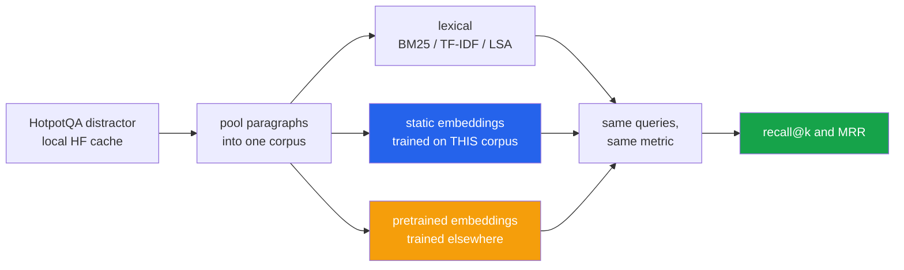

<h1 align="center">embedding-fair-comparison</h1>
<p align="center"><i>Method, or training data?</i></p>

<p align="center">
  <a href="#the-result">Results</a> &middot;
  <a href="#the-same-method-spans-0808">The same method spans 0.808</a> &middot;
  <a href="#the-setup">Setup</a> &middot;
  <a href="#what-is-held-constant">What is held constant</a> &middot;
  <a href="#limitations">Limitations</a> &middot;
  <a href="#run-it">Run it</a>
</p>

<p align="center">
  
  
  
  
  
  <a href="LICENSE"></a>
</p>

---

> ### Most embedding comparisons are training-data comparisons wearing a method comparison's clothes.

The standard tutorial puts **TF-IDF fitted on your corpus** next to **pretrained word
vectors trained on 100 billion words** next to **pretrained BERT**, and concludes that the
neural method is better.

That conflates two different variables. This separates them: every method is scored on the
same corpus, the same queries and the same metric, and the ones **trained locally** are
reported separately from the ones that **arrived pretrained**.

It also includes **BM25** — the baseline almost no embedding comparison reports, and the one
that keeps turning out to be hard to beat.

---

## The result

HotpotQA distractor split · 2,964 documents · **277,259 tokens** · 300 queries · exactly 2
gold documents each · 0 missing gold.

| Method | Trained on | r@1 | r@5 | **r@10** | r@20 | MRR |
|---|---|---:|---:|---:|---:|---:|
| **BGE-small** | billions of words, elsewhere | **0.437** | 0.868 | **0.943** | **0.967** | **0.923** |
| **nomic-embed** | billions of words, elsewhere | 0.432 | 0.868 | 0.935 | 0.965 | 0.915 |
| **BM25** | this corpus | 0.355 | 0.665 | 0.865 | 0.933 | 0.799 |
| TF-IDF | this corpus | 0.288 | 0.623 | 0.842 | 0.923 | 0.710 |
| LSA (SVD) | this corpus | 0.173 | 0.463 | 0.735 | 0.855 | 0.513 |
| word2vec | **this corpus** | 0.033 | 0.092 | **0.140** | 0.198 | 0.128 |
| fastText | **this corpus** | 0.027 | 0.085 | **0.135** | 0.192 | 0.117 |

**r@1 cannot exceed 0.500 here** — every query has exactly two gold documents and one slot,
so recall at rank 1 is capped at one half by construction. BGE's 0.437 is 87% of the
attainable maximum, not 44% of it.

---

## "Dense embedding retrieval" spans 0.808

Four of these rows are dense vectors compared by cosine similarity — BGE-small and
nomic-embed, word2vec and fastText. One category, one corpus, one query set, one metric.
They land at **0.943, 0.935, 0.140 and 0.135**.

The split is not by architecture, and it is not by recency. It falls exactly along **where
the vectors came from**. word2vec and fastText saw this corpus's 277,259 tokens. BGE and
nomic-embed saw perhaps four orders of magnitude more text, somewhere else, before ever
meeting this task.

**That is an 0.808 swing within "use embeddings", produced by training data.** The largest
gap the method axis produces between two methods fitted on identical data — BM25 against
LSA — is **0.130**.

So when a tutorial reports "embeddings beat TF-IDF", it is reporting a fact about a download.
Run an embedding method on the corpus in front of you and it does not beat TF-IDF; it loses
to it by **0.702**.

### The cleanest controlled comparison is the worst news for word2vec

LSA, word2vec and fastText are the three vector methods where *everything* is genuinely
held constant: same corpus, same **300 dimensions**, same metric, no pretraining anywhere.

| Method (all 300d, all fitted here) | r@10 |
|---|---:|
| LSA — truncated SVD on a TF-IDF matrix | **0.735** |
| word2vec — skip-gram with negative sampling | 0.140 |
| fastText — the same, plus subword units | 0.135 |

**A 1990s matrix factorisation beats both neural objectives by about 0.6 on identical
input.** This is not a small-corpus excuse — LSA had exactly the same small corpus. It is
specific to the method: 277,259 tokens over 25,295 types is far below what a skip-gram
objective needs to learn useful geometry, and it does not degrade gracefully, it collapses.

Whatever word2vec's advantage over LSA is, you cannot obtain it by running word2vec. You
obtain it by downloading someone else's.

### Two more things the full table shows

**Two pretrained models, built by different groups on different data with different
architectures and different widths, agree to within 0.008.** Whatever BGE-small and
nomic-embed are each doing, the result is nearly the same result. Which pretrained encoder
you pick was never the interesting variable.

**BM25 — zero parameters, zero training, a tenth of a second to index — beats every method
trained on this corpus**, including both static embeddings and LSA, and lands within 0.078
of the best pretrained model at r@10 and 0.034 at r@20. If a reranker or an LLM is going to
read the top 20 anyway, BM25 hands it very nearly the same candidates.

---

## The setup

**Why HotpotQA's distractor split.** Each question ships ten paragraphs, exactly two of
which are gold. The ground truth is exact, so there are no relevance judgements to guess at.
Pooling paragraphs across many questions turns "pick 2 from 10" into "pick 2 from ~3,000",
which is a retrieval problem rather than multiple choice.

**No downloads.** The dataset is read from the local Hugging Face cache; BM25, TF-IDF, LSA,
word2vec and fastText all train on the corpus itself.



## What is held constant

A comparison is only about the method if nothing else moves:

| Variable | Held at |
|---|---|
| Tokenizer | one shared function, for every lexical method |
| Corpus | identical |
| Queries | identical |
| Metric | recall@1/5/10/20 and MRR |
| **Dimensionality** | **300 for every vector method fitted here** — LSA, word2vec, fastText — so a win is not simply a wider vector |
| Pooling | plain mean of word vectors, for the methods that need pooling |

The one thing deliberately **not** held constant is training data, because that is the
variable under test. It is a column in the table, not a footnote.

**What could not be held constant.** The pretrained models arrive at their own widths —
BGE-small is 384-dimensional, nomic-embed 768 — and neither can be re-dimensioned without
retraining it. So the 300-dimension control covers the corpus-trained methods and *not* the
pretrained ones. That is a genuine confound, reported here rather than in a footnote: part
of the pretrained advantage may be width. It is not plausibly 0.8 of it, since LSA at 300
dimensions reaches 0.735 while word2vec at the same 300 reaches 0.140.

---

## Limitations

- **Index time is deliberately not in the table.** It was measured, but this machine ran
  three unrelated GPU training jobs during the pretrained arms, which stretched
  nomic-embed's indexing to 13,884 s — roughly twenty times what an idle machine gives.
  Publishing that next to BM25's 0.1 s would report contention as if it were a property of
  the method. The numbers are in `results/scores.json` with this caveat attached.
- **One corpus, one domain.** HotpotQA paragraphs are Wikipedia prose. Nothing here says
  how these methods compare on code, legal text or transcripts.
- **300 queries**, not the full split. Enough to separate methods that differ by 0.8, not
  enough for tight confidence intervals — and no intervals are reported.
- **Mean pooling is crude.** Better pooling would lift the static embeddings. That is
  deliberate: the question is what the *method* buys at the level everyone actually uses it.
  It would not lift them by 0.8.
- **Retrieval only.** A cross-encoder reranker on top would change every number here, and
  is not part of this comparison. Project 03 measures exactly that.
- **BGE gets its query prefix**, as its authors intend. That is a small advantage the
  lexical methods have no equivalent of.
- **Nothing here shows the pretrained models would win on a large corpus.** The claim is
  narrower and more useful: on a corpus you actually have, the method you can train is not
  the method in the paper.

## Run it

```bash
python src/evaluate.py 300             # score all seven methods
python src/evaluate.py 300 BM25,TfIdf  # or just some
pytest -q                              # 24 tests, no dataset, no network
```

The nomic-embed arm needs `ollama serve` with `nomic-embed-text` pulled. It caches every
document vector to `results/nomic_cache.json`, checkpointing every 200 documents, so an
interrupted run resumes instead of restarting — which matters, because it is one HTTP
round-trip per document.

## Tests

24 tests on a hand-built five-document corpus — no dataset, no network. They check the
metrics, the shared tokenizer, and BM25's actual properties: that term frequency
**saturates**, that length is **penalised**, and that IDF is never negative.

Two groups are regression tests. `TruncatedSVD` raises rather than clamping when
`n_components` exceeds the vocabulary size, so LSA crashed on any small corpus until it was
clamped. And five cover the embedding cache: that a resumed run reproduces the uninterrupted
matrix exactly, that a fully cached run makes no requests, and that checkpoints are written
*during* the loop rather than only at the end — a crash at document 2,900 used to discard
all 2,899.

## Layout

```
src/retrievers.py   seven methods, including BM25 implemented rather than imported
src/evaluate.py     score them all, write results/scores.json
tests/              24 tests, no dataset needed
results/            scores.json
```

## Stack

`Python 3.11+` · `scikit-learn` · `sentence-transformers` · `gensim` · `Ollama` ·
`NumPy` · `pandas` · `pytest`

## Keywords

word embeddings · word2vec · fastText · BM25 · TF-IDF · LSA · LSI · SVD ·
sentence embeddings · BGE · nomic-embed · retrieval · information retrieval · recall@k ·
MRR · HotpotQA · lexical vs dense retrieval · sparse retrieval · NLP · fair comparison ·
ablation · training data vs method · reproducible evaluation

## Licence

MIT — see [LICENSE](LICENSE).
