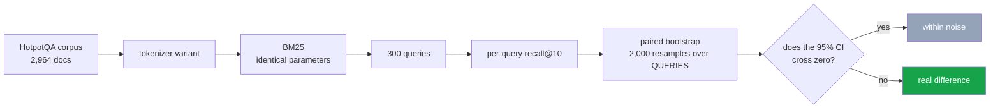

<h1 align="center">02 · Preprocessing ablation</h1>
<p align="center"><i>The step that does nothing on its own destroys the gains from the two that work</i></p>

<p align="center">
  <a href="#the-result">Result</a> &middot;
  <a href="#why-the-full-pipeline-loses">Why the full pipeline loses</a> &middot;
  <a href="#method">Method</a> &middot;
  <a href="#limitations">Limitations</a> &middot;
  <a href="#run-it">Run it</a>
</p>

<p align="center">
  
  
  
  
  
</p>

---

> ### Stemming works. Stopword removal works. Stack them with a third step and the result becomes indistinguishable from doing nothing.

Every NLP tutorial teaches the same pipeline — lowercase, strip punctuation, remove
stopwords, stem, drop short tokens — as though it were one step called "preprocessing".

It is not one step. It is several independent decisions, and **they are not additive.**

---

## The result

BM25 on HotpotQA. 2,964 documents, 300 queries, exactly 2 gold each. Identical retriever,
corpus, queries and metric across every row — **only the tokenizer changes**.

Significance is a **paired bootstrap over queries** (2,000 resamples), because every
variant is scored on the same queries.

| Variant | recall@10 | Δ vs baseline | 95% CI | p | Verdict |
|---|---:|---:|---|---:|---|
| baseline (lowercase only) | 0.865 | — | — | — | *baseline* |
| **stopwords + stemming** | **0.888** | **+0.023** | [+0.007, +0.040] | **0.005** | ✅ **REAL** |
| + Porter stemming | 0.887 | +0.022 | [+0.007, +0.038] | 0.012 | ✅ **REAL** |
| + remove stopwords | 0.877 | +0.012 | [+0.002, +0.023] | 0.034 | ✅ **REAL** |
| **the full tutorial pipeline** | 0.875 | +0.010 | [−0.008, +0.028] | 0.360 | ❌ **within noise** |
| + drop tokens < 3 chars | 0.862 | −0.003 | [−0.013, +0.007] | 0.676 | ❌ within noise |
| no lowercasing | 0.857 | −0.008 | [−0.023, +0.007] | 0.353 | ❌ within noise |

**3 of 6 differences are distinguishable from noise at n=300.** The other three are not,
and are reported as such rather than ranked.

---

## Why the full pipeline loses

The full pipeline is exactly `stopwords + stemming + drop tokens under 3 characters`.

| | Δ | p |
|---|---:|---:|
| stopwords + stemming | **+0.023** | **0.005** ✅ |
| drop tokens < 3, on its own | −0.003 | 0.676 ❌ |
| **all three together** | **+0.010** | **0.360** ❌ |

Adding a step that measurably does nothing **destroys a real, significant improvement.**

The mechanism is not mysterious: **Porter stemming produces short stems.** `aging` → `ag`,
`using` → `us`. The length filter then deletes exactly the tokens stemming just created,
and the two steps work against each other.

That interaction is invisible if you evaluate "preprocessing" as one block — which is how
it is almost always taught, and almost always measured.

---

## Method



**The bootstrap resamples queries, not scores**, because the query is the unit of
variation. Resampling anything else would produce intervals that are too narrow.

**The Porter stemmer and the stopword list are written out in `src/preprocess.py`** rather
than imported. Both are specifications rather than algorithms with hidden choices, and the
exact behaviour being measured should be readable.

Worth knowing about that standard list: it removes **`no`, `not` and `own`** — words that
change what a query means.

## Limitations

- **One retriever.** BM25 only. Whether preprocessing interacts the same way with a dense
  retriever is untested — and dense retrievers usually do their own subword tokenisation,
  which makes the question different rather than the same.
- **One corpus, one domain.** Wikipedia prose. Stemming helps more on morphologically rich
  text and less on text that is already lemmatised.
- **n = 300.** Three differences are significant; a larger sample would narrow every
  interval and might promote the ones currently called noise. **The absence of a
  significant difference is not evidence that there is none.**
- **Porter, not Snowball or lemmatisation.** Porter is the classic and the one in every
  tutorial. A lemmatiser would not produce the 2-character stems that drive the headline
  interaction.
- **One parameter setting.** BM25's `k1` and `b` are fixed at 1.5 and 0.75. Preprocessing
  and length normalisation both act on document length, so tuning `b` per variant could
  change the ranking.

## Run it

```bash
python src/ablate.py 300         # the ablation table
python src/significance.py 300   # paired bootstrap - which differences are real
pytest -q                        # 29 tests, no dataset, no network
```

## Tests

29 tests. The Porter cases come from the behaviour the **1980 paper** specifies, so a
regression in the stemmer surfaces as a failing assertion rather than as a quietly
different number in the results table.

One test exists purely to protect the headline:
`test_stemmer_can_produce_short_stems` asserts that stemming creates tokens a length
filter would delete. If that stops being true, the interaction finding no longer holds and
the README is wrong.

Three tests check the bootstrap itself — that identical scores are never significant, that
a large consistent gap is, and that **a small noisy gap is not.**

## Layout

```
src/preprocess.py     stopword list, Porter stemmer, composable tokenizers
src/ablate.py         BM25 once per variant
src/significance.py   paired bootstrap over queries
tests/                29 tests, no dataset needed
results/              ablation.json, significance.json
```

## Keywords

text preprocessing · Porter stemmer · stemming · stopword removal · tokenisation ·
BM25 · information retrieval · ablation study · paired bootstrap · statistical
significance · confidence intervals · HotpotQA · NLP pipeline · feature interaction ·
reproducible evaluation
