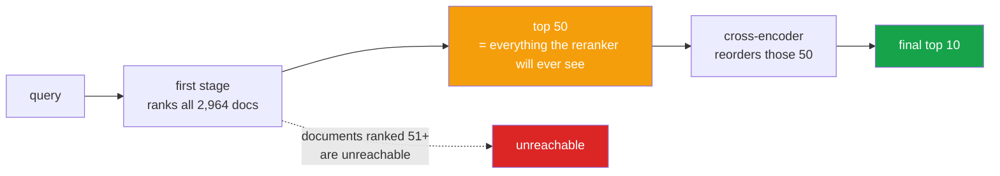

<h1 align="center">03 · The reranker ceiling</h1>
<p align="center"><i>A reranker cannot retrieve what was never fetched</i></p>

<p align="center">
  <a href="#the-result">Result</a> &middot;
  <a href="#the-ceiling">The ceiling</a> &middot;
  <a href="#what-this-means-for-project-01">What it means for project 01</a> &middot;
  <a href="#limitations">Limitations</a> &middot;
  <a href="#run-it">Run it</a>
</p>

<p align="center">
  
  
  
  
</p>

---

> ### Reranking collapses the gap between retrievers from 10.2 points to 2.3. The expensive retriever buys you two points.

A cross-encoder can only **reorder** what the first stage handed it. So the first stage's
recall@50 is a hard **ceiling** on anything achievable at k ≤ 10, regardless of how good
the reranker is.

That turns an argument into a measurement.

---

## The result

BM25, TF-IDF, BGE-small and a **random control** as first stages. Top-50 reranked by
`cross-encoder/ms-marco-MiniLM-L-6-v2`. HotpotQA, 2,964 documents, 300 queries.

| First stage | r@10 before | r@10 after | Change | Ceiling (r@50) | Converted |
|---|---:|---:|---:|---:|---:|
| **BM25** | 0.865 | **0.922** | **+0.057** | 0.967 | 95.3% |
| **TF-IDF** | 0.842 | **0.918** | **+0.076** | 0.955 | 96.1% |
| **BGE-small** | 0.943 | 0.942 | **−0.001** | 0.978 | 96.3% |
| random (control) | 0.003 | 0.022 | +0.019 | 0.022 | 100% |

**Spread between the three real retrievers: 0.102 before reranking → 0.023 after.**

### Three things fall out

**1. BGE gains nothing.** −0.001. It was already ordering its results well, so the
reranker had no work left to do. The retrievers that *improve* are the cheap ones.

**2. Every first stage converts about 96% of its ceiling** — 95.3%, 96.1%, 96.3%. The
conversion rate is essentially constant. **What differs between retrievers is not how well
they rank, but what they fetch at all.**

So the first stage's job is **recall@50, not ranking.** Optimising a first-stage retriever
for precision@10 is optimising the wrong metric when a reranker sits behind it.

**3. The random control proves the ceiling is real.** It converts **100%** of its ceiling
and still scores 0.022, because a reranker cannot retrieve a document that was never
fetched. Without this row, the ceiling would be an assertion.

---

## The ceiling



Everything the first stage ranks below position 50 is **permanently unreachable**. The
reranker's best possible recall@10 equals the first stage's recall@50 — nothing more.

`test_a_perfect_reranker_cannot_exceed_the_first_stage_ceiling` asserts exactly this with
an oracle reranker: gold placed at rank 60 stays lost no matter how perfect the scoring.

---

## What this means for project 01

[Project 01](../01_embedding_fair_comparison) found BM25 within 8 points of BGE at
recall@10, and treated that as BM25 doing well.

This puts a harder frame on it: **if a reranker is in the pipeline — and in any serious
RAG system it is — that 8-point gap shrinks to 2.** BM25 indexes in 0.1 s; BGE takes 27.8 s
and needs a model. For two points.

That is not an argument against dense retrieval. It is an argument that **the retriever
comparison in project 01 measured something a downstream reranker largely erases**, and
reporting first-stage numbers without saying whether a reranker follows is reporting half
the system.

---

## Limitations

- **One reranker.** A MiniLM cross-encoder is small and fast. A larger one would convert
  more of each ceiling, and might widen the gap again rather than narrow it.
- **Depth is fixed at 50.** The whole finding is a function of this number. At depth 10
  the reranker can do almost nothing; at depth 200 the ceilings converge further and the
  gap likely shrinks again. **Depth is the variable this project does not sweep**, and it
  should be.
- **n = 300, single run.** The 0.023 post-rerank spread is small enough that it deserves
  the same paired bootstrap [project 02](../02_preprocessing_ablation) uses. It has not
  been run here.
- **Latency is ignored.** Reranking 50 candidates per query costs roughly 40 s across 300
  queries on a Quadro RTX 5000 — real time that the "BM25 is cheaper" conclusion does not
  account for. The cheap retriever plus a reranker is not cheap overall.
- **HotpotQA questions are short and factual.** Cross-encoders are strongest exactly there.
  Longer or vaguer queries would likely convert less.

## Run it

```bash
python src/rerank.py 300    # the table above
pytest -q                   # 11 tests, no model, no network
```

## Tests

11 tests, and **the reranker is never loaded** — what is under test is the arithmetic of
the ceiling argument, which is where the claim lives.

The important ones use an **oracle reranker** (perfect scores) to establish the bound:
gold at rank 60 stays unreachable at depth 50, gold at rank 40 is fully recoverable, and
reranking can never introduce a document the first stage missed.

## Layout

```
src/rerank.py   first stages, the random control, rerank and score
tests/          11 tests on the ceiling arithmetic
results/        rerank.json
```

## Keywords

reranking · cross-encoder · two-stage retrieval · recall ceiling · first-stage retrieval ·
BM25 · dense retrieval · BGE · ms-marco · MiniLM · RAG pipeline · retrieval depth ·
candidate generation · HotpotQA · ablation · control condition
