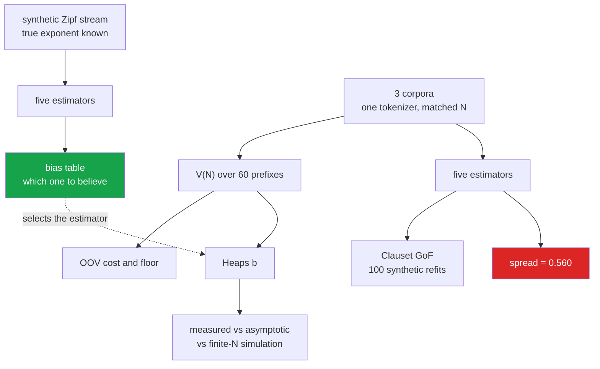

<h1 align="center">05 · Zipf and Heaps</h1>
<p align="center"><i>Five estimators of one exponent span 0.56 on the same million tokens — and the correction for the best-known bias is the worst of the five.</i></p>

<p align="center">
  <a href="#the-result">Result</a> &middot;
  <a href="#which-estimator-should-be-believed">Which estimator</a> &middot;
  <a href="#is-it-a-power-law-at-all">Is it a power law</a> &middot;
  <a href="#heaps-law">Heaps' law</a> &middot;
  <a href="#what-a-fixed-vocabulary-costs">The bill</a> &middot;
  <a href="#problems-hit-while-building-this">Problems hit</a> &middot;
  <a href="#limitations">Limitations</a>
</p>

<p align="center">
  
  
  
  
  
</p>

---

> ### On one million tokens of English prose the Zipf exponent is 0.858, or 1.032, or 1.271, or 1.418, depending only on which standard estimator is used. The distribution then fails the power-law goodness-of-fit test outright.

Two numbers travel under the name *the Zipf exponent*:

| | | estimated by |
|---|---|---|
| **rank-frequency** | f(r) ∝ r<sup>−a</sup> | least squares on a log-log plot |
| **frequency distribution** | P(f) ∝ f<sup>−g</sup> | Clauset's maximum likelihood fit |

They are related by `g = 1 + 1/a`, so a paper reporting 1.0 and a paper reporting 2.0 can be reporting the same corpus. **Every number in this project is converted to `a`** before it is tabulated, which is the only reason the five are comparable at all.

---

## The result

One million tokens, one tokenizer, five estimators that all appear in the literature.

| Estimator | English prose | C source |
|---|---:|---:|
| OLS over all ranks | 1.271 | 1.167 |
| OLS, top 1000 ranks | 0.858 | 1.005 |
| OLS, log-binned | 1.032 | 1.013 |
| MLE (Clauset), converted | 1.418 | 1.064 |
| split-half (Piantadosi) | 1.063 | 0.924 |
| **spread** | **0.560** | **0.243** |

The spread on prose is **0.56** — larger than the gap between any two registers, any two languages, or any two of the competing generative theories these exponents are quoted to support.

---

## Which estimator should be believed

The corpora cannot say, because their true exponent is unknown. Synthetic text can: draw tokens from a Zipf distribution with a chosen `a`, hand the stream to all five, and the error is observable.

200,000 tokens per stream, 8 streams per setting, mean signed error:

| Estimator | a = 0.8 | a = 1.0 | a = 1.2 | a = 1.5 | **mean \|bias\|** |
|---|---:|---:|---:|---:|---:|
| OLS, top 1000 ranks | −0.009 | −0.008 | −0.009 | −0.029 | **0.014** |
| MLE (Clauset) | −0.022 | −0.022 | −0.017 | −0.036 | **0.024** |
| OLS, log-binned | −0.024 | −0.035 | −0.049 | −0.061 | **0.042** |
| OLS over all ranks | −0.040 | −0.169 | −0.279 | −0.315 | **0.201** |
| **split-half (Piantadosi)** | −0.312 | −0.355 | −0.379 | −0.353 | **0.350** |

Two things fall out, and the second was not expected.

**The textbook plot is the second-worst estimator.** OLS over every rank is biased by −0.20 on average and the bias *grows* with the true exponent. The cause is the singleton shelf: thousands of types share a count of 1 and are spread across thousands of consecutive ranks, producing a long flat run that is an artefact of sequential ranking, and the regression fits it like data.

**Piantadosi's correction is the most biased of the five.** Ranking on one half of the tokens and taking frequencies from the other does remove the correlated-error problem it was designed for. It also discards every type that appears in the ranking half and not in the frequency half — 16,416 of 39,911 types on the prose corpus — and those are exactly the rarest ones. Removing the tail flattens the line, and the flattening is four times larger than the bias it fixes. This is the residual censoring bias Pilgrim & Hills (2021) predict; measured here it is −0.35 and roughly constant across exponents.

Sections on Heaps' law and the tokenizer take their exponent from the least-biased estimator **by reading this table at runtime**, not from a default chosen in advance.

> These are i.i.d. draws with no burstiness, no topic and no document structure. Real text has all three, so every bias here is a **floor**, not an estimate.

---

## Is it a power law at all

Clauset's goodness-of-fit test: fit, measure the KS distance, then generate 100 synthetic datasets from the fitted model, refit each **from scratch including x_min**, and ask how often a synthetic dataset fits its own model worse than the data fits its own.

| Corpus | x_min | g | KS | p | Verdict |
|---|---:|---:|---:|---:|---|
| HotpotQA paragraphs | 2 | 1.705 | 0.0118 | **0.00** | **power law rejected** |
| Devign C functions | 14 | 1.940 | 0.0060 | 0.62 | cannot be ruled out |

**English word frequencies fail the test. C identifier frequencies pass it.**

The prose rejection is not marginal: not one of 100 synthetic datasets fitted its own model as badly as the data fits its own. The exponents in the table above are therefore all estimates of a parameter of a distribution that has been ruled out — which does not make them useless as descriptions, but does make "the Zipf exponent of English is 1.x" a statement about a fitted line rather than about a law.

A large p is **not** evidence for a power law. `x_min` is chosen freely, so against a near-miss distribution the search can retreat into a short far tail where a power law does fit. `test_gof_has_limited_power_against_a_geometric` asserts that limit rather than leaving a reader to find it.

---

## Heaps' law

Vocabulary growth `V(N) = K · N^b`, fitted over 60 log-spaced prefixes.

| Corpus | N | **b measured** | R² | b asymptotic | b finite-N simulation |
|---|---:|---:|---:|---:|---:|
| HotpotQA paragraphs | 1,000,000 | **0.717** | 0.9974 | 1.000 | 0.839 |
| Devign C functions | 1,000,000 | **0.817** | 0.9979 | 0.995 | 0.812 |
| MBPP + HumanEval | 40,637 | **0.721** | 0.9877 | 0.835 | 0.719 |

The asymptotic relation `b = min(1, 1/a)` predicts **1.000** for prose against a measured **0.717** — it is wrong by 0.28, and it is wrong in the direction of claiming the vocabulary grows linearly with the text, which it visibly does not.

Simulating a corpus of *the same finite size* from the fitted Zipf distribution predicts 0.839, cutting the error from 0.283 to 0.122. This is Lü, Zhang & Zhou's (2010) point made on real corpora: the textbook relation is an infinite-size result, and no corpus is infinite.

### b is not a constant

Fitted in sliding windows along the same curve:

| Corpus | window range | b |
|---|---|---|
| HotpotQA paragraphs | 100 → 1,000,000 tokens | 0.784 → **0.631** |
| Devign C functions | 100 → 1,000,000 tokens | 0.829 → **0.666** |
| MBPP + HumanEval | 10 → 40,637 tokens | 0.335 → **0.802** |

R² of 0.997 says a straight line fits the log-log curve well. It does not say the slope is the same at both ends, and it is not. **A Heaps exponent quoted without a token count names no quantity** — which is also why the small Python corpus is never compared against the other two at face value.

---

## What a fixed vocabulary costs

Vocabulary cut from the first half of the stream, priced on the second — which is how a vocabulary is actually used. Rates are over **tokens**, not types.

| Corpus | 2k | 8k | 16k | 32k | 50k | 100k | **floor** |
|---|---:|---:|---:|---:|---:|---:|---:|
| HotpotQA paragraphs | 25.69% | 13.12% | 9.40% | 7.04% | 6.49%* | 6.49%* | **6.49%** |
| Devign C functions | 29.18% | 19.50% | 15.68% | 12.74% | 11.19%* | 11.19%* | **11.19%** |
| MBPP + HumanEval | 27.63%* | 27.63%* | 27.63%* | 27.63%* | 27.63%* | 27.63%* | **27.63%** |

`*` marks a vocabulary larger than the training half contains — past that point the size parameter does nothing.

The plateau on the right of each row is **a floor, not a diminishing return**. The training half of the prose corpus holds 36,764 types; 6.49% of held-out tokens are of types it never contained, and no vocabulary size built from that text reaches them. That is Heaps' law restated as a bill: because `b < 1` and V never saturates, held-out text always contains words the training text did not.

**C source pays 1.7× the prose rate at every vocabulary size**, and its floor is 11.19% against 6.49%. Identifier names are effectively an open class invented per project. A vocabulary budget tuned on English prose is not transferable to code.

---

## Method



**One tokenizer for all three registers.** Case-folded runs of word characters, applied identically to English and to source code. A code-aware tokenizer for code and a prose tokenizer for prose would make every cross-register difference a difference in preprocessing. Section 7 re-runs everything under the code-aware tokenizer as a sensitivity column, never as the result.

**Matched token count.** The three corpora span two orders of magnitude, and the Heaps exponent depends on corpus size, so every cross-register number is measured at 1,000,000 tokens — the most the smaller of the two large corpora allows. The Python corpus (40,637 tokens) is held back and used only where finite size is the subject.

**Prefixes, not samples.** The vocabulary curve is measured over a prefix of the token stream in the dataset's own order. Shuffling would impose a homogeneity real text does not have.

### How much of it was the tokenizer

| Corpus | tokenizer | tokens | types | a |
|---|---|---:|---:|---:|
| HotpotQA paragraphs | word | 1,000,000 | 55,983 | 0.858 |
| HotpotQA paragraphs | code-aware | 1,000,000 | 57,903 | 0.932 |
| Devign C functions | word | 1,000,000 | 66,749 | **1.005** |
| Devign C functions | code-aware | 1,000,000 | 42,340 | **1.236** |
| MBPP + HumanEval | word | 40,637 | 3,003 | 1.198 |
| MBPP + HumanEval | code-aware | 78,646 | 3,221 | 1.341 |

Changing the tokenizer moves C's exponent by **0.231**. Under one tokenizer, the prose-to-C difference is 0.147. **The preprocessing choice moves the answer further than the thing being compared** — so a cross-register exponent comparison is only meaningful with the tokenizer named, and most published ones do not name it.

---

## Problems hit while building this

**The KS statistic returned the same number for a power law and a geometric.** Both gave exactly 0.2581. The textbook `i/n` form of the statistic assumes no ties; word counts are almost all ties, so for the first member of the block at `x_min` it compared the theoretical CDF against `(i−1)/n = 0` and reported `F(x_min)` — the height of the atom, a constant of the model, for any data whatsoever. The fix is to evaluate the empirical CDF once per distinct value and compare its left limit against `F(v−1)`, not `F(v)`. `test_ks_separates_a_power_law_from_a_geometric` is the regression test, and it asserts a **ratio** rather than a threshold, because a ratio is what a usable statistic has to deliver.

**The split-half estimator returned −2.44, confidently.** `Generator.choice(p=...)` draws one uniform per sample and maps it through the cumulative distribution. The split mask was `u < 0.5` from a generator seeded identically to the one that made the synthetic corpus — so it selected precisely the tokens whose cumulative probability was below one half, which is the head of the distribution and nothing else. Twelve types reached the ranking half instead of eleven thousand, one point survived the pairing, and `lstsq` returned a minimum-norm solution for a single point without complaint. Two changes: the split now draws from independent entropy, and `_ols_slope` raises rather than fitting a line to fewer than ten points. The second is what would have made the first loud instead of silent.

**SciPy would not install.** The only thing needed from it was the Hurwitz zeta for the discrete CDF. At the download speed available, a forty-megabyte wheel was a worse trade than forty lines of Euler–Maclaurin, so `src/hurwitz.py` computes it directly — and is checked against π²/6, π⁴/90, Apéry's constant and its own recurrence rather than against another library, which would not be a check when the library is the thing being removed.

**The scaled zeta exists because the unscaled one silently produced NaN.** The KS search visits fitted exponents in the hundreds on data that is not a power law. There `q ** -s` underflows to zero, the survival ratio becomes 0/0, and the search compares NaNs and picks whatever it happened to start with. `zeta(..., scaled=True)` returns `zeta(s, q) · q^s` so the two underflowing factors cancel analytically.

---

## Limitations

- **The power-law rejection is about the fitted family, not about Zipf's observation.** Word frequencies are unmistakably heavy-tailed and the rank-frequency plot is unmistakably near-linear over several decades. What is rejected is that a pure discrete power law above some `x_min` generated the counts. A lognormal is not tested here and would very likely not be rejected either — distinguishing the two needs a likelihood-ratio test this project does not run.
- **The goodness-of-fit test loses power as n grows.** Free selection of `x_min` lets it retreat into a short far tail. The geometric control is rejected at n = 5,000 and not at n = 50,000.
- **Two corpora, not two languages.** "English prose" is one encyclopaedic register from one dataset. Nothing here licenses a claim about English.
- **The sensitivity column is not a matched comparison.** Matching *token* counts across tokenizers does not match the amount of text: 1,000,000 code-aware tokens of C covers much less source than 1,000,000 word tokens, which is why its type count falls.
- **`support` in the finite-size simulation is a modelling choice** with no correct value — the theoretical distribution is unbounded and a real vocabulary is not. It is set to twice the observed type count and reported.
- **The extrapolation to 100,000 types assumes a constant b**, which the drift table shows is false. It is included because it is the calculation people actually perform, and it is labelled as unsound where it appears.
- **Devign's train split has never been obtainable here** — the same 17.85 MB download that blocked `devign-leakage` and project 04. The C corpus is test + validation only.

## Run it

```bash
python src/run.py            # every table above, ~70 s
python src/run.py --quick    # smaller N, fewer bootstrap samples, ~15 s
python src/corpora.py        # corpus sizes only
pytest -q                    # 77 tests, no dataset, no network
```

## Tests

77 tests. Every estimator is checked against a number that was **chosen before it was measured**: OLS against an exactly constructed power law, the MLE against a sampler whose exponent is known, `fit_beta` against a curve built with the exponent it must find, and the Hurwitz zeta against closed forms.

Three are regression tests for the bugs above, and one — `test_the_five_estimators_do_not_agree` — asserts the finding itself, so that a future change which quietly makes them agree fails the build instead of rewriting the conclusion.

## Layout

```
src/hurwitz.py   Hurwitz zeta by Euler-Maclaurin, with a scaled path for large exponents
src/zipf.py      five estimators, KS machinery, Clauset goodness-of-fit bootstrap
src/heaps.py     vocabulary curve, b and its drift, OOV cost and the irreducible floor
src/corpora.py   three registers from the Hugging Face cache, one tokenizer
src/validate.py  estimator bias measured on text whose exponent is known
src/run.py       every table in this README
results/         study.json, vocabulary_curves.json
```

## Keywords

Zipf's law · Heaps' law · power-law fitting · maximum likelihood estimation · Kolmogorov-Smirnov ·
Clauset Shalizi Newman · goodness of fit · bootstrap · Hurwitz zeta · Euler-Maclaurin ·
vocabulary growth · type-token ratio · out-of-vocabulary rate · vocabulary size · tokenization ·
estimator bias · heavy-tailed distributions · corpus linguistics · finite-size effects
