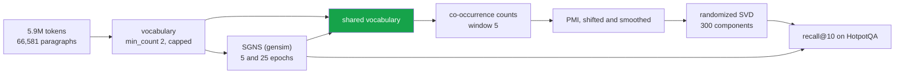

<h1 align="center">06 · PPMI-SVD vs SGNS</h1>
<p align="center"><i>Skip-gram with negative sampling is factorising a shifted PMI matrix. So factorise it directly, and transfer its hyperparameters one at a time.</i></p>

<p align="center">
  <a href="#the-result">Result</a> &middot;
  <a href="#the-ladder">The ladder</a> &middot;
  <a href="#method">Method</a> &middot;
  <a href="#problems-hit-while-building-this">Problems hit</a> &middot;
  <a href="#limitations">Limitations</a>
</p>

<p align="center">
  
  
  
</p>

---

Levy & Goldberg (2014) proved that skip-gram with negative sampling, at its optimum, is
factorising a word-context matrix whose cells are

```
M[w, c] = PMI(w, c) - log k
```

with `k` the number of negative samples. The neural model is not learning a different kind
of representation. It is computing a shifted PMI matrix and factorising it implicitly.

Levy, Goldberg & Dagan (2015) followed that with the practical claim: most of what
separates a neural word embedding from a counting model is not the objective but a handful
of preprocessing and weighting decisions that shipped with the neural implementations and
were never applied to the counting ones.

This project transfers those decisions one at a time and measures each.

---

## The result

> ### After transferring word2vec's hyperparameters, a pure counting model scores 0.371 against SGNS's 0.371 — a difference of −0.001, p = 0.969. Nothing separates them but the hyperparameters.

5,929,439 tokens of HotpotQA paragraphs, 66,581 documents, 1,000 questions, 300 dimensions,
one shared 20,000-word vocabulary. No gradient is computed anywhere on the counting side.

| Configuration | recall@10 | Δ |
|---|---:|---:|
| PPMI + SVD, as usually taught | 0.118 | — |
| + dynamic context window | 0.107 | **−0.011** |
| + subsample frequent words | 0.193 | +0.074 |
| + context distribution smoothing | 0.194 | +0.076 |
| + shifted PMI (k = 5) | 0.311 | **+0.193** |
| + eigenvalue weighting p = 0.5 | **0.371** | **+0.253** |
| + add context vectors (w + c) | 0.326 | **−0.045** |

| | recall@10 |
|---|---:|
| SGNS, 5 epochs | 0.088 |
| **SGNS, 25 epochs** | **0.371** |
| **best counting model** | **0.371** |
| difference | **−0.001** [−0.019, +0.017], p = 0.969 — **within noise** |

**The textbook counting model reaches 32% of what SGNS achieves. The same counting model
with word2vec's hyperparameters reaches 100% of it.** Tripling the baseline took no change
of objective, no neural network and no training — only decisions that were published
alongside word2vec and never applied to the thing it was compared against.

### Which decision did the work

**The negative-sampling shift is the single largest transfer (+0.193 on its own).** It is
also the one that looks least like a modelling choice: `k` reads as an optimisation detail
of how negative examples are drawn, and Levy & Goldberg's derivation shows it is a term in
the objective — `log k` subtracted from every cell. Applied to a counting model it is one
line, and it is worth more than every other transfer combined.

**Two of the seven rungs made things worse.** The dynamic context window cost 0.011, and
adding the context vectors cost 0.045 from the peak. Both are standard recommendations;
neither survives on this task. They are reported as measured rather than dropped from the
ladder, because a ladder that only contains the rungs that worked is not an ablation.

**SGNS at 5 epochs scores 0.088 and at 25 epochs scores 0.371.** Project 01's `Word2Vec`
retriever — and many tutorials — use 5. On a corpus this size that setting is not a weak
result, it is a broken one, and a comparison against it would have flattered the counting
side by 0.283.

### Do the two spaces hold the same words together?

Matching on a task is weak evidence that two methods learned the same thing — two mediocre
spaces can score alike for different reasons. So the top-10 neighbour sets are compared
directly, over the 2,000 most frequent shared words. This needs no gold data at all.

| Counting model | mean Jaccard@10 with SGNS | words with no overlap |
|---|---:|---:|
| PPMI + SVD, as usually taught | **0.397** | 1.1% |
| + eigenvalue weighting p = 0.5 (best) | 0.321 | 2.1% |

**Two of every five nearest neighbours are shared, and almost no word's neighbourhood is
disjoint** — the direct prediction of the implicit-factorisation result, measured rather
than inferred from matching scores.

The second row is the interesting one. **The configuration that matches SGNS on the task
agrees with it *less* about which words are alike** (0.321 against 0.397). Equal task
performance is not the same space. Whatever the eigenvalue weighting is doing for retrieval,
it is moving the geometry away from SGNS's, not towards it — so "the counting model caught
up" and "the counting model reproduces word2vec" are two different claims, and only the
first one is supported here.

---

## Method



**One vocabulary for both sides.** The counting side caps its vocabulary to keep a V×V
matrix tractable; gensim caps its own by `min_count` and arrives at a different set.
Compared as trained, one method could embed words the other cannot read, and the retrieval
score would be partly a coverage score. Both sides are restricted to the intersection
before anything is scored. That is why SGNS is trained *first* — its vocabulary is an input
to the comparison, not an output of it.

**SGNS gets a fair run.** Hyperparameters match project 01's `Word2Vec` retriever exactly
(300 dimensions, window 5, `min_count` 2, 5 negative samples, seed 0), and it is trained at
both 5 and 25 epochs with the better of the two reported. A neural baseline deliberately
starved of epochs would make the counting side look good for the wrong reason.

**Every rung changes one thing.** Each configuration inherits the one above it and alters a
single decision, so the delta on a row is attributable to the name on that row.

**Pooling is the crudest available** — the mean of the word vectors present, unit
normalised, identical to project 01's. The question is what the *matrix* buys, not what a
better pooling strategy buys.

---

## Problems hit while building this

**ARPACK never finished.** `scipy.sparse.linalg.svds` is a Krylov method, and its cost
grows badly with the number of components requested. At 300 components on a 20,000-square
PMI matrix it had not produced a single factorisation after twelve minutes. Replaced with
Halko, Martinsson & Tropp's randomized range finder, written out in `src/factorize.py`: one
rung now takes about eighty seconds. It is checked against ARPACK on small matrices —
singular values, and the subspace the vectors span — because an approximation that
converged to the wrong subspace would still return vectors.

The power iterations in it are not decoration. A PMI matrix has a slowly decaying spectrum
with no rank cutoff, so with `n_iter=0` the random subspace is contaminated by the tail and
the recovered singular values come out too small.
`test_power_iterations_help_on_a_slowly_decaying_spectrum` measures that rather than
asserting it.

**A query with no known words scored perfectly.** Its pooled vector is all zeros, so every
document scores exactly 0, and `argpartition` on a tie returns an arbitrary *k* — which
sometimes contained the gold document. The scorer was paying a method for its vocabulary
gaps, and the smaller vocabulary would have scored better the more often it failed. Such
queries are now scored zero and counted.

**Re-tokenizing the corpus eight times.** The obvious implementation of mean pooling
re-reads every document for every embedding. With eight embeddings over 66,581 paragraphs
that is eight passes of Python-level tokenizing to produce eight matrices whose only
difference is the vectors being looked up. Counting once into a sparse document-by-term
matrix turns pooling into a single matmul; `test_pooler_reproduces_the_naive_pooling`
asserts the fast path and the obvious one agree, because an optimisation that changed the
score would be a bug wearing the costume of a tuning parameter.

---

## Limitations

- **Retrieval, not word similarity.** WordSim-353, SimLex-999 and the Google analogy set
  are the usual intrinsic evaluations and none is in the local cache; downloading them
  would make this the one project in the lab that needs a dataset. Recall@10 is a coarser
  instrument, and it cannot see the analogy result — which is exactly where Levy & Goldberg
  report that SGNS stays ahead of SVD. **Nothing here tests analogies, so nothing here
  contradicts that.**
- **Not comparable with project 01's table.** That project scores on `build(300)`, 2,964
  paragraphs. This one needs a far larger corpus to train embeddings on at all and uses all
  66,581. Recall@10 depends on how many documents the gold two are hiding among, so only
  the numbers within this project may be compared with each other.
- **The vocabulary cap is a tractability bound.** The co-occurrence matrix is V×V and the
  corpus has 160,743 types. Capping changes what the tail of the PMI matrix contains, and
  the cap is reported rather than hidden.
- **The ladder is one order.** Each rung inherits the one above it, so a decision's measured
  value is its value *given* the ones already applied. A different order could attribute
  the gains differently; interactions are not separated here, which is the same caveat
  project 02 raises about preprocessing steps that do not compose.
- **SGNS with four workers is not bit-reproducible.** gensim's threads interleave updates,
  so a rerun moves the third decimal. The differences reported here are far larger than
  that, and `workers=1` would make a 25-epoch run over six million tokens slow enough to
  discourage rerunning it at all.
- **5.9 million tokens is a small corpus for word embeddings.** Both sides are handicapped
  by it, and neither result should be read as what either method does at scale.

## Run it

```bash
python src/run.py            # every table above
python src/run.py --quick    # a tenth of the corpus, 150 dimensions
pytest -q                    # tests, no dataset, no network
```

`gensim` is an optional extra (`uv sync --extra sgns`). Without it the counting ladder still
runs and the SGNS rows are skipped.

## Layout

```
src/cooccurrence.py  vocabulary, subsampling, the windowed count matrix
src/pmi.py           PMI, the negative-sampling shift, context distribution smoothing
src/factorize.py     randomized SVD, eigenvalue weighting, the Embedding container
src/sgns.py          gensim skip-gram, matched to project 01's hyperparameters
src/evaluate.py      pooling, recall@10, neighbour agreement, paired bootstrap
src/run.py           the ladder and the comparison
results/             ladder.json
```

## Keywords

word2vec · skip-gram · negative sampling · SGNS · PPMI · shifted PMI · pointwise mutual
information · matrix factorisation · truncated SVD · randomized SVD · context distribution
smoothing · subsampling · dynamic context window · eigenvalue weighting · distributional
semantics · word embeddings · Levy Goldberg · count-based vs predictive · HotpotQA
